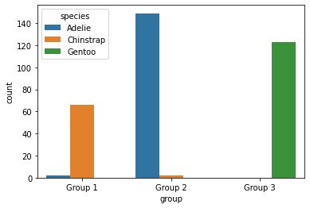

[](https://mybinder.org/v2/gh/4dcu-be/ClassifyingPenguins/HEAD)

# Classifying Palmer's Penguins

Here are some notebooks of various experiments to use Dirichlet based mixture models to classify a number of datasets like the Iris, Fish Market and Palmer Penguins datasets. 

There is a common challenge in biology that sometimes you are working with a mixture of species and you don't know per se which specimen belongs to which species. Or within one species it might be hard to tell the difference between male and female subjects. So unsupervised classification could be a solution here. To show how this 
can be done using PyMC3 models these notebooks were created. 



## Running the Notebook

You can open the notebooks on [Binder](https://mybinder.org/v2/gh/4dcu-be/ClassifyingPenguins/HEAD), though you might need to decrease the number of samples to avoid time-outs.

To get the code running locally the easiest option is using [Anaconda]

```bash
git clone https://github.com/4dcu-be/ClassifyingPenguins
cd ClassifyingPenguins
conda env create -f environment.yml
conda activate pymc3
jupyter notebook
```

In case you are running this on windows you might need to install libpython in the environment and you will need Visual Studio Code 2017 build tools (with the C tools, check the options).

## References

  * palmerpenguins: Palmer Archipelago (Antarctica) penguin data. Allison Marie Horst and Alison Presmanes Hill and Kristen B Gorman, 2020 [link](https://allisonhorst.github.io/palmerpenguins/)
  * Fish Market dataset [link](https://www.kaggle.com/aungpyaeap/fish-market)